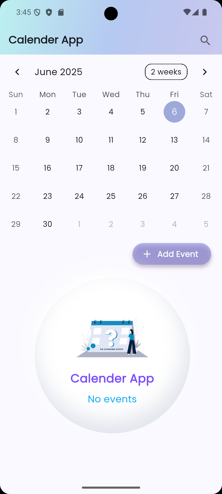
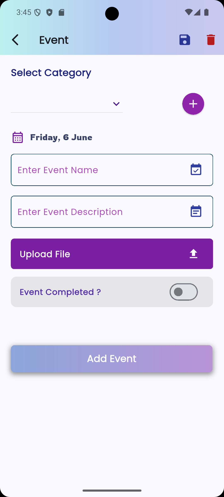

# flutter-hive-calendar-app

A Flutter-based **Calendar Events App** using Hive for local storage.
This app allows users to **add, view, search, and manage events** with support for event descriptions and file uploads — all stored offline using Hive.

---

## ✨ Features

- 📅 Calendar UI for Browse events
- ➕ Add events with:
  - Event title
  - Description
  - File upload (e.g. PDF, image)
- 🔍 Search for events by keyword
- 🗂 View all events on the home screen
- ❌ Delete events easily
- 💾 Offline data storage using Hive
- 🧼 Clean architecture and modular code structure

---

## 🛠️ Tech Stack

| Tech                | Description                                      |
|--------------------|--------------------------------------------------|
| **Flutter** | Cross-platform UI framework                      |
| **Dart** | Language used for Flutter                        |
| **Hive** | Lightweight, NoSQL database for local storage    |
| **hive_flutter** | Flutter integration for Hive                     |
| **Flutter Widgets**| For building responsive and intuitive UI         |
| **Clean Architecture** | Separation of concerns for scalability and maintenance |

---

## 📸 Screenshots

_Add images to the `assets/` folder and update the paths below._


<p align="center">

 &nbsp; &nbsp; &nbsp; 

<br>

Home Page &nbsp; &nbsp; &nbsp;&nbsp; &nbsp; &nbsp; &nbsp; &nbsp; &nbsp; &nbsp; &nbsp; &nbsp;&nbsp; &nbsp; &nbsp; &nbsp; &nbsp; &nbsp; &nbsp; &nbsp; &nbsp;&nbsp; &nbsp; &nbsp; &nbsp; &nbsp; &nbsp; &nbsp;  &nbsp; &nbsp; Add Event Page

</p>

---


## 🚀 Getting Started

1.  Clone the repository
    ```bash
    git clone [https://github.com/darshh009/flutter-hive-calendar-app.git](https://github.com/darshh009/flutter-hive-calendar-app.git)
    cd flutter-hive-calendar-app
    ```
2.  Install dependencies:
    ```bash
    flutter pub get
    ```
3.  Run the app:
    ```bash
    flutter run
    ```

---

## 📧 Contact

For any inquiries, please reach out to: **darshhwork@gamil.com**
